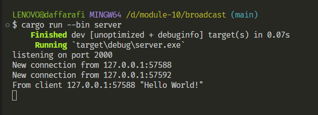
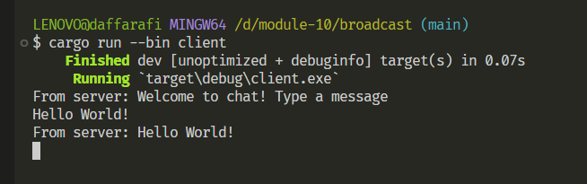
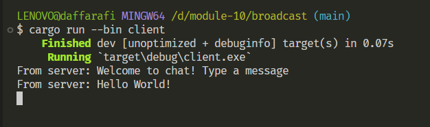

## Experiment 2.1: Original code, and how it run

server.rs dan client.rs menunjukkan interaksi antara server dan klien melalui WebSocket menggunakan model asinkron dan broadcast channel untuk mengirim pesan ke beberapa klien. Server mendengarkan koneksi di alamat "127.0.0.1:2000" dan menyebarkan pesan ke semua klien yang terhubung. Saat klien terhubung, server mengirim pesan selamat datang dan mulai mendengarkan pesan dari klien. Jika server menerima pesan dari klien, pesan tersebut disebarkan ke semua klien yang terhubung. Klien dapat mengirim pesan berdasarkan input pengguna dan mendengarkan pesan yang diterima dari server. Dalam contoh ini, klien pertama mengirim "Hello World!", yang kemudian disebarkan ke semua klien, sehingga klien kedua yang terhubung kemudian juga menerima pesan "Hello World!" meskipun belum mengirim apa pun.

